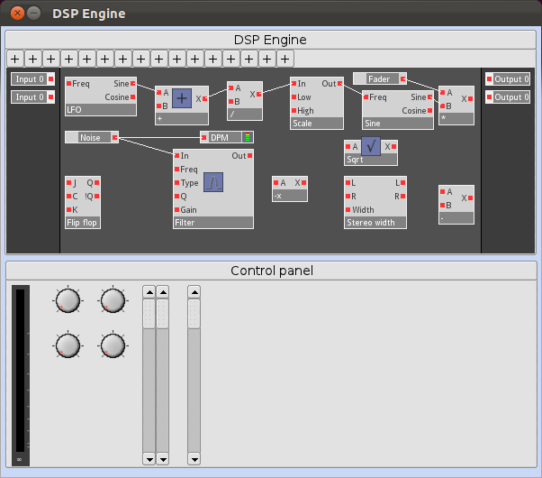

The goal of this project is to create an open source multipurpose DSP system for professional audio. Think of someting like an old analog modular synthesizer, but running as software in a rackmounted device. With low latency, multiple inputs and outputs, small DSP building blocks you get almost unlimited possibilities to process a signal as you want.

Need a mixer? Make a preset!

Need a LMS? Make a preset!

Need a multiband compressor? Make a preset!

Need a synthesizer? Make a preset!

### An old screenshot from an early software version from 2012.

### Example of how the hardware could possible look in the future.

[TODO: Insert picture of hardware]